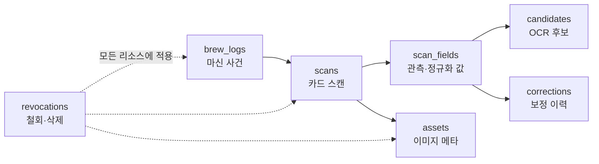

# Beanote → Bean Wiki 연동 결정 기록

- 상태: 합의 초안
- 계약 버전: `1`
- 갱신일: 2026-07-28
- 대상: Beanote 소유자·개발자, Bean Wiki 개발자

이 문서는 양쪽에서 합의한 범위와 아직 결정해야 할 항목을 짧게 유지하는
조정 문서입니다. 구현 세부는 다음 문서를 정본으로 사용합니다.

- [데이터 허브 화면 명세](./BEANOTE-DATA-HUB-SPEC.md)
- [Data API v1·Export 계약](./BEANOTE-DATA-API-V1.md)
- [대표 `scan_observation.v1` JSON Schema](./beanote-scan-observation-v1.schema.json)
- [대표 API 응답 예시](./beanote-scan-observation-v1.example.json)

## 1. 합의된 결론

기존 **유저 데이터** 화면은 개별 스캔을 조회·검수하는 운영 도구로 유지합니다.
대량 반출, 외부 API, 권한, 승인, 감사는 최상위 **데이터 허브** 메뉴에서
관리합니다.

1차 범위는 **소유자 전용 T1 가명 데이터 Export**입니다.

- 대량 분석: 데이터셋별 JSONL
- Excel·BI 검토: 데이터셋별 CSV
- 부속 파일: `manifest.json`, `data_dictionary.json`,
  `checksums.sha256`, `revocations.jsonl`
- 기본 데이터셋: `brew_logs`, `scans`, `scan_fields`
- 선택 데이터셋: `candidates`, `corrections`, `assets` 메타데이터
- 제외: 사진 파일, 자유 메모, 이메일, 닉네임, 원본 사용자 ID, 사용자 GPS

API의 메시지 형식은 JSON이고, 대량 Export의 레코드 형식은 JSONL입니다.
“JSON인가 JSONL인가”는 양자택일이 아닙니다.

| 전달면 | 정식 형식 | 이유 |
| --- | --- | --- |
| API 응답 | JSON envelope | 요청·버전·privacy·lineage·page와 데이터를 함께 전달 |
| 대량 Export | JSONL + manifest | 데이터셋별 스트리밍과 부분 실패 복구 |
| Excel·BI | 데이터셋별 CSV | 사람이 열어 검토하고 BI 도구에서 사용 |
| 사진 | 별도 파일 또는 만료 URL | JSON base64 금지, T3 승인 필요 |

## 2. 실제 수집 범위에 따른 결정

이 표는 “무엇이 현재 존재하고 1차 계약에서 어떻게 다룰지”를 답합니다.

| 항목 | 실제 상태 | 1차 결정 | 계약 위치 |
| --- | --- | --- | --- |
| 카페 이름 | 수집 중 | T1 유지 | `brew_logs.cafe_name` |
| 원두·커피 이름 | 수집 중 | T1 유지 | `brew_logs.coffee_name` |
| 메뉴 이름 | 별도 필드 없음 | 선택형 `menu_name` 추가 | `brew_logs.menu_name` |
| 사용자 GPS | 수집하지 않음 | 추가하지 않음 | 계약에 없음 |
| 카페 위치 | 공개 주소·좌표 구조 존재 | 내부 `business_place_id`로만 연결 | T1에는 장소 ID·일반화 지역만 |
| 성별·나이 | 수집하지 않음 | 분석 목적 확정 전 추가 금지 | 계약에 없음 |
| OCR 원문·후보·신뢰도·보정 | 저장 중 | T2 별도 scope | `scans`, `scan_fields`, `candidates`, `corrections` |
| 정제된 소스 이미지 | 저장 중 | T3, 1차 제외 | `assets.role = source_image` |
| 분석용 이미지 | 저장 중 | T3, 1차 제외 | `assets.role = analysis_image` |

Beanote에서 현재 `original`이라고 부르는 이미지는 휴대폰 원본 파일이 아니라
EXIF/GPS 제거와 재인코딩을 거친 JPEG입니다. 콘솔과 계약에서는 **원본 사진**이
아닌 **정제된 소스 이미지(`source_image`)**라고 표시합니다.

## 3. 데이터 관계

한 개의 거대한 CSV나 중첩 객체로 모든 정보를 합치지 않습니다.



공통 연결 키:

- `subject_key`: API Client마다 다른 가명 사용자 키
- `brew_log_id`: 마신 사건
- `scan_id`: 해당 사건에 연결된 스캔
- `scan_field_id`: OCR이 관측하거나 정규화한 하나의 필드
- `asset_id`: 이미지 메타데이터
- 각 리소스의 `revision`: 수정·삭제 순서

## 4. 데이터 접근 등급

등급은 데이터의 “중요도”가 아니라 외부 제공에 필요한 통제 수준을 뜻합니다.
상위 등급 권한이 하위 등급을 자동 포함하는지는 API Client 정책에서 명시해야
합니다. 1차 MVP는 T1만 활성화합니다.

| 등급 | 제공 범위 | 기본 대상 | 1차 상태 |
| --- | --- | --- | --- |
| T0 | 최소 인원 기준을 통과한 집계·통계 | 분석가 | 후속 |
| T1 | 가명화된 커피 기록과 구조화 필드 | 개발자 | **MVP** |
| T2 | OCR 원문·후보·신뢰도·보정 이력 | 승인된 개발자 | API v1 후속 |
| T3 | 이미지·자유 메모·직접 식별 가능 정보 | 소유자 승인·재인증·기간 제한 | 1차 제외 |

`subject_key`는 고객사/API Client별로 다른 값이어야 합니다. 원본 사용자 ID에
고정 salt를 붙인 단순 해시는 여러 외부 기관 사이의 연결 가능성을 만들 수 있어
사용하지 않습니다.

## 5. 빈 값과 품질 상태

JSON에는 `NaN`, `Infinity`, `undefined`를 넣지 않습니다. 값이 없으면 `null`로
보내고 상태를 함께 전달합니다.

개발자 제안의 `quality.state` 하나는 “값이 왜 없는가”와 “누가 검수했는가”를
동시에 표현하기 어려워 두 축으로 나눕니다.

```json
{
  "raw_value": "ETHIOPIA",
  "normalized_value": "Ethiopia",
  "confidence": 0.98,
  "quality": {
    "value_state": "present",
    "verification_state": "verified",
    "is_outlier": false
  }
}
```

| 축 | 허용 값 |
| --- | --- |
| `value_state` | `present`, `missing`, `not_collected`, `redacted`, `expired`, `invalid`, `parse_failed` |
| `verification_state` | `unverified`, `verified`, `corrected`, `not_applicable` |
| `is_outlier` | `true`, `false`, `null` |

신뢰도는 API와 Export에서 항상 `0..1`로 정규화합니다. 기존 저장값이 `98`이라면
계약 값은 `0.98`입니다. 원 제공자의 척도와 변환 규칙은
`data_dictionary.json`과 `lineage.pipeline_version`에 기록합니다.

CSV에는 값 열과 함께 `<field>_value_state`,
`<field>_verification_state`, `<field>_is_outlier` 열을 둡니다.

## 6. Bean Wiki에서의 사용 경계

Bean Wiki에 이미 존재하는
`POST /api/integrations/coffee-cherry`는 `store/menu/bean/recipe` 추천을 받는
간단한 집계용 API입니다. Beanote의 OCR 계보, 철회, 개별 음용 기록을 담을 수
없으므로 정식 연동 API로 확장하지 않습니다.

초기에는 Beanote Export를 오프라인으로 검증합니다. Data API v1이 준비된 뒤
Bean Wiki가 읽기 전용으로 pull합니다. Bean Wiki는 다음을 구현해야 합니다.

- JSON Schema 및 contract/schema version 검증
- `source + resource_id + revision` 기반 idempotent upsert
- 마지막으로 성공한 cursor만 저장
- `revocations` 처리 후 원본·검색 인덱스·집계·캐시에서 삭제
- Beanote 출처와 OCR/정규화/사용자 평가의 구분
- T1 데이터에서 공개 추천을 만들기 전 별도의 공개·집계 정책 적용

## 7. 실행 순서

### 0단계 — 정책 승인

- Bean Wiki 제공 목적과 이용 주체
- 제공 필드와 privacy tier
- 보존기간과 다운로드 만료
- 재제공 제한
- 철회·삭제 SLA
- T2/T3 승인권자

정책 승인이 없으면 실제 사용자 데이터를 사용한 Export를 배포하지 않습니다.

### 1단계 — 데이터 허브 MVP

- 수집 현황
- 소유자 전용 비동기 Export
- T1 JSONL/CSV
- manifest·dictionary·checksums·revocations
- 감사 로그

### 2단계 — Data API v1

- API Client와 scope
- 읽기 전용 resource API
- cursor, rate limit, 키 회전·폐기
- revocation feed
- 호출·승인 감사

### 3단계 — 제한 Raw 접근

- T2 OCR Raw
- T3 이미지·자유 메모
- 건별 승인 또는 기간 제한 grant
- 짧게 만료되는 이미지 URL

### 4단계 — 신규 수집

- 선택형 `menu_name`
- 위치·성별·나이는 명확한 분석 목적과 별도 정책 승인 전까지 추가하지 않음

## 8. 아직 확정할 질문

이 항목만 실제 Beanote 코드와 정책을 확인한 뒤 확정하면 구현을 시작할 수
있습니다.

1. `brew_log`, `scan`, `field`, `asset`의 실제 PK와 수정 시각은 무엇인가?
2. 삭제가 soft delete인지 hard delete인지, tombstone을 어디에 보존할 것인가?
3. 현재 사용자 동의는 T1 외부 제공까지 포함하는가, 새 동의가 필요한가?
4. `business_place_id`와 공개 주소 중 T1에서 어느 지역 단위까지 제공할 것인가?
5. OCR confidence가 DB에서 사용하는 실제 척도와 nullable 규칙은 무엇인가?
6. 소스 이미지와 분석 이미지의 실제 저장 키·보존기간은 무엇인가?
7. Export 생성·다운로드·만료·파기 로그를 얼마나 오래 보관할 것인가?
8. Bean Wiki가 데이터 수령자인지 수탁자인지 등 법적 관계를 어떻게 정리할 것인가?

## 9. 개발자에게 보낼 회신

> 네, 제안한 `데이터 허브` 분리가 맞습니다. 1차 범위는
> **소유자 전용 T1 가명 데이터의 데이터셋별 CSV/JSONL Export**로 확정하고,
> 데이터 허브 화면 명세와 Data API v1 계약서 초안을 진행해주세요.
>
> 몇 가지는 계약에서 명확히 하고 싶습니다. API 응답은 JSON envelope,
> 대량 반출은 JSONL+manifest로 구분하고, `brew_logs/scans/scan_fields/
> candidates/corrections/assets/revocations`를 별도 데이터셋으로 둡니다.
> confidence는 외부 계약에서 항상 `0..1`로 정규화하고, 결측 원인
> (`value_state`)과 검수 상태(`verification_state`)는 분리해주세요.
> 현재 `original` 이미지는 콘솔에서 `정제된 소스 이미지`로 표기하고 T3로
> 두며, 사진·자유 메모는 MVP에서 제외해주세요.
>
> 먼저 실제 DB 필드 → 계약 필드 매핑표와 현재 동의가 T1 외부 제공을
> 포괄하는지 확인한 결과를 보여주세요. 정책 승인 전에는 실제 사용자 데이터
> Export를 배포하지 않고 합성 fixture로 검증하면 좋겠습니다. 첨부한
> `BEANOTE-DATA-HUB-SPEC.md`, `BEANOTE-DATA-API-V1.md`, JSON Schema와 예시를
> 초안 기준으로 사용해주세요.

## 10. Beanote 저장소에서 실행할 구현 프롬프트

```text
당신은 Beanote 모바일 앱과 관리자 콘솔 저장소에서 작업한다.

목표:
기존 유저 데이터 화면은 개별 스캔 검수용으로 유지하고, 최상위 데이터 허브에서
수집 현황·비동기 Export·API Client·승인/감사를 관리한다. Phase 1에서는
소유자 전용 T1 가명 데이터의 JSONL/CSV Export만 구현한다.

첨부 계약:
- BEANOTE-INTEGRATION.md
- BEANOTE-DATA-HUB-SPEC.md
- BEANOTE-DATA-API-V1.md
- beanote-scan-observation-v1.schema.json
- beanote-scan-observation-v1.example.json

코드를 쓰기 전에:
1. docs/media-lifecycle.md, docs/supabase-schema.sql,
   docs/local-training-export.md, docs/admin-console.md 전체 관련 구간과 실제
   구현을 확인한다.
2. brew_logs, scans, scan_fields, candidates, corrections, assets,
   revocations의 실제 테이블·뷰·PK·FK·수정·삭제 구조를 표로 정리한다.
3. 실제 DB 필드 → 계약 필드 매핑표를 만든다. 없는 데이터는 추측하지 않는다.
4. 현재 동의·약관이 T1 외부 제공을 포괄하는지 정책 blocker로 명시한다.
5. 기존 학습 데이터 내보내기 코드를 재사용할 수 있는 범위를 확인한다.

Phase 1 필수 구현:
- 최상위 메뉴: 운영 현황 | 유저 데이터 | 데이터 허브
- 데이터 허브: 수집 현황 | 내보내기 | API 접근 | 승인·감사
- 수집 현황에 행 수, 최신 시점, 결측률, 보존기간, 동의 근거, 외부 제공 가능
  여부 표시
- 소유자만 T1 Export 생성 가능
- dataset: brew_logs, scans, scan_fields; candidates/corrections/assets metadata는
  실제 정책에 따라 선택
- format: JSONL 또는 데이터셋별 CSV
- ZIP bundle: manifest.json, data_dictionary.json, checksums.sha256,
  revocations.jsonl, data/* 파일
- 사진 파일·자유 메모·이메일·닉네임·원본 user ID·사용자 GPS 제외
- source image를 original photo라고 표시하지 않기
- 24시간 기본, 최대 72시간 다운로드 만료
- Export 상태: queued, running, ready, failed, expired, revoked
- 생성·승인·다운로드·만료·폐기 감사 로그
- 합성 데이터 fixture만 사용

계약 규칙:
- API는 Supabase를 직접 노출하지 않고 앱 서버를 통한다.
- 외부별로 다른 subject_key를 안정적으로 만든다.
- API JSON envelope에는 contract_version, schema_version, request_id,
  snapshot_at, privacy, lineage, page, data가 들어간다.
- JSONL 각 줄은 한 resource 객체이고 공통 envelope는 manifest에 둔다.
- null에는 quality.value_state를 함께 둔다.
- quality.value_state와 quality.verification_state를 분리한다.
- confidence는 0..1로 정규화한다.
- resource ID + revision으로 idempotent 처리가 가능해야 한다.
- 철회·삭제는 revocations.jsonl과 후속 API feed에서 전달한다.
- 사진은 base64로 보내지 않는다.

테스트:
- 관리자/소유자 권한
- 승인되지 않은 tier·dataset 차단
- 행 수·ID·FK 무결성
- JSONL 한 줄 한 JSON object
- CSV의 한글·쉼표·따옴표·줄바꿈
- null과 모든 value_state
- confidence 범위 0..1
- 동일 요청의 결정적 snapshot
- checksum 검증
- 다운로드 만료·폐기
- 철회 대상이 Export와 후속 feed에 반영
- 로그에 secret·OCR Raw·자유 메모가 남지 않음

완료 보고:
- 조사한 실제 구조와 매핑표
- 구현한 범위와 intentionally deferred T2/T3
- migration과 환경 변수
- 실행한 테스트와 정확한 결과
- 정책 blocker와 남은 위험

정책 승인 없이 실제 사용자 데이터 Export를 배포하거나 T2/T3를 활성화하지 않는다.
```

## 11. 참고 기준

이 문서는 법률 자문이 아니라 기술·제품 통제 초안입니다. 실제 사용자 데이터
외부 제공 전에는 국내 개인정보 전문가가 목적, 법적 관계, 동의, 가명처리
적정성, 보존·파기를 검토해야 합니다.

- [개인정보보호위원회 비정형데이터 가명처리 안내](https://m.pipc.go.kr/np/cop/bbs/selectBoardArticle.do?bbsId=BS074&mCode=C020010000&nttId=9899)
- [개인정보 보호법 시행령 제29조의5 관련 규정](https://www.law.go.kr/LSW/lsLinkCommonInfo.do?chrClsCd=010202&lspttninfSeq=159009)
- [RFC 3339 — 인터넷 timestamp](https://www.rfc-editor.org/rfc/rfc3339.html)
- [RFC 9457 — HTTP API Problem Details](https://www.rfc-editor.org/rfc/rfc9457.html)
- [JSON Schema Draft 2020-12](https://json-schema.org/draft/2020-12/json-schema-core)
