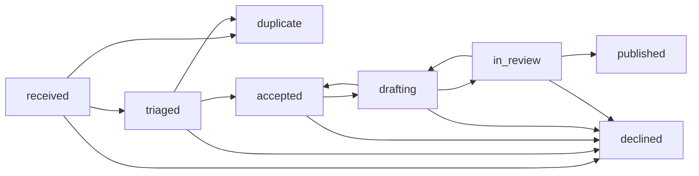
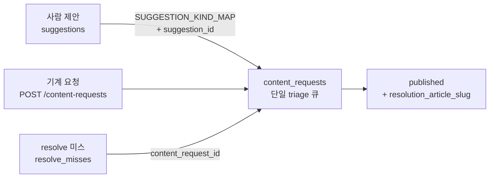

# Content Request API v1

- 문서 ID: `content-request-api-v1`
- 계약 버전: `1`
- 상태: 구현 기준
- 갱신일: 2026-07-28
- 대상: 사내 앱·에이전트 개발자, Bean Wiki 편집·운영자

Bean Wiki가 **받는** 방향의 계약입니다. envelope, problem+json, cursor,
credential 형식, scope 문법, 멱등성, 웹훅 서명 규칙은
[PLATFORM-CONTRACT-V1](./PLATFORM-CONTRACT-V1.md)이 정본입니다. 여기서는
리소스, 검증 한도, 상태 기계만 정의합니다.

주는 방향은 [KNOWLEDGE-API-V1](./KNOWLEDGE-API-V1.md)입니다.

두 리소스가 있습니다.

| 리소스 | GitHub 비유 | 무엇을 보내는가 |
| --- | --- | --- |
| 콘텐츠 요청 | Issue | "이걸 설명하는 글이 없다" |
| 기여 | Pull Request | "초안을 써 왔다" |

기여 엔드포인트는 **게시하지 않습니다**(§9).

## 1. 엔드포인트

| 메서드 | 경로 | scope | `schema_version` | 인증 |
| --- | --- | --- | --- | --- |
| POST | `/api/requests/v1/content-requests` | `content-requests:write` | `content_request.v1` | 필수 |
| GET | `/api/requests/v1/content-requests` | `content-requests:read` | `content_request.v1` | 필수 |
| GET | `/api/requests/v1/content-requests/{id}` | `content-requests:read` | `content_request.v1` | 필수 |
| PATCH | `/api/requests/v1/content-requests/{id}` | `content-requests:triage` | `content_request.v1` | 필수 |
| POST | `/api/requests/v1/contributions` | `contributions:write` | `contribution.v1` | 필수 |
| GET | `/api/requests/v1/contributions` | `contributions:write` | `contribution.v1` | 필수 |

- 지식 API와 달리 익명 호출이 없습니다. 전부 `Authorization: Bearer bwk_…`가
  필요합니다.
- `OPTIONS`와 CORS 헤더가 없습니다. 브라우저에서 직접 호출하는 용도가
  아닙니다.
- 기여 목록 조회도 `contributions:write`를 요구합니다. `contributions:read`
  scope는 존재하지 않습니다(§11).

## 2. POST `/content-requests` — 요청 제출

### 2.1 요청 본문

```json
{
  "external_id": "scan-gap-2026-07-flavor-bergamot",
  "kind": "new_vocabulary_entity",
  "title": "향미 어휘에 베르가못 추가 요청",
  "body": "테이스팅 카드 OCR에서 반복 관측되지만 resolve가 매칭하지 못합니다.",
  "locale": "ko",
  "priority_hint": "normal",
  "entity_refs": [
    { "id": "origin:et", "role": "context" },
    "process:natural"
  ],
  "demand_evidence": {
    "observation_count": 37,
    "window": "P30D",
    "context": "tasting-card scanner, flavor field",
    "unresolved_terms": ["베르가못", "bergamot", "bergamotte"]
  },
  "callback_url": "https://scanner.example.com/hooks/bean-wiki"
}
```

### 2.2 검증 — 구현된 한도 그대로

| 필드 | 타입 | 필수 | 기본값 | 한도·규칙 | 위반 시 |
| --- | --- | --- | --- | --- | --- |
| `external_id` | string | 예 | — | 1..160자. 멱등성 키 | 400 `invalid-request` |
| `kind` | enum | 아니오 | `new_article` | `REQUEST_KINDS` 6종 | 400 |
| `title` | string | 예 | — | 4..160자(`trim` 후) | 400 |
| `body` | string | 아니오 | `""` | 최대 4000자. 최소 없음 | 400 |
| `locale` | enum | 아니오 | `ko` | `ko` 또는 `en`만 | 400 |
| `priority_hint` | enum | 아니오 | `normal` | `low`, `normal`, `high` | 400 |
| `entity_refs` | array | 아니오 | `[]` | 최대 20개. 각 항목은 문자열 또는 `{ id, role? }` | **422 `unprocessable`** |
| `entity_refs[].id` | string | 예(있을 때) | — | 등재된 어휘 id여야 함 | **422** |
| `demand_evidence` | object | 아니오 | `{}` | 아래 표 | 조용히 절삭 |
| `callback_url` | string | 아니오 | `null` | `https:`만 허용 | 400 |

`kind` 허용 값:

| 값 | 뜻 |
| --- | --- |
| `new_article` | 새 문서가 필요함 |
| `expand_article` | 기존 문서 보강 |
| `correct_article` | 사실 정정 |
| `new_glossary_term` | 용어집 항목 추가 |
| `new_vocabulary_entity` | 어휘 엔터티 추가 |
| `question` | 질문·기타 |

`demand_evidence` 하위 필드는 거부하지 않고 정리해서 저장합니다.

| 필드 | 규칙 |
| --- | --- |
| `observation_count` | 유한한 수이고 `>= 0`이면 내림해서 저장. 아니면 생략 |
| `window` | 최대 40자 |
| `context` | 최대 400자 |
| `unresolved_terms` | 문자열만 남기고 최대 50개, 각 120자로 절삭. 남는 게 없으면 필드 자체를 생략 |

### 2.3 알 수 없는 어휘 id는 422입니다

`entity_refs`의 id가 어휘에 없으면 400이 아니라 `422 unprocessable`입니다.
본문 문법은 맞고 의미 검증만 실패했기 때문입니다. `detail`은 다음 행동을
지시합니다.

```json
{
  "type": "https://bean-wiki.vercel.app/problems/unprocessable",
  "title": "Semantic validation failed",
  "status": 422,
  "detail": "Unknown vocabulary id `origin:atlantis`. Resolve it via /api/knowledge/v1/resolve first.",
  "request_id": "req_0f3a9c21b47e5d6081af2c34"
}
```

### 2.4 응답

| 상황 | 상태 | 본문 |
| --- | --- | --- |
| 새로 생성 | `201` | 저장된 요청 전체 |
| 같은 `external_id` 재전송 | `200` | **기존 행 그대로** |

두 경우 모두 `Location: /api/requests/v1/content-requests/<id>` 헤더가 붙습니다
(상대 경로).

```json
{
  "contract_version": 1,
  "schema_version": "content_request.v1",
  "request_id": "req_0f3a9c21b47e5d6081af2c34",
  "snapshot_at": "2026-07-28T09:12:00Z",
  "data": {
    "id": "cr_7f2a91c05be34d16a8c2",
    "client_id": "cl_scanner_prod",
    "external_id": "scan-gap-2026-07-flavor-bergamot",
    "kind": "new_vocabulary_entity",
    "title": "향미 어휘에 베르가못 추가 요청",
    "body": "테이스팅 카드 OCR에서 반복 관측되지만 resolve가 매칭하지 못합니다.",
    "locale": "ko",
    "entity_refs": [
      { "id": "origin:et", "role": "context" },
      { "id": "process:natural" }
    ],
    "demand_evidence": {
      "observation_count": 37,
      "window": "P30D",
      "context": "tasting-card scanner, flavor field",
      "unresolved_terms": ["베르가못", "bergamot", "bergamotte"]
    },
    "priority_hint": "normal",
    "status": "received",
    "resolution_article_slug": null,
    "resolution_url": null,
    "declined_reason": null,
    "duplicate_of": null,
    "suggestion_id": null,
    "revision": 1,
    "created_at": "2026-07-28 09:12:00",
    "updated_at": "2026-07-28 09:12:00"
  }
}
```

- `callback_url`은 저장하되 **응답에 되돌려주지 않습니다.** 조회 SELECT 목록에
  없습니다.
- `created_at`·`updated_at`은 SQLite `CURRENT_TIMESTAMP` 형식
  (`YYYY-MM-DD HH:MM:SS`, UTC)입니다. RFC 3339의 `T`·`Z`가 없습니다(§11).
- 생성 시 `content_request_events`에 `null → received`, `actor_type: "client"`,
  `actor_ref: <client_id>` 항목이 하나 기록됩니다.

## 3. 멱등성 계약

구현: `createRequest()`의 `(client_id, external_id)` 유일 인덱스
(`content_request_idempotency_idx`).

| 규칙 | 동작 |
| --- | --- |
| 같은 키 재전송 | 새 행을 만들지 않고 **저장된 행을 손대지 않은 채** 반환 |
| 재전송이 본문을 바꿈 | 무시. `title`·`body`가 갱신되지 않습니다 |
| 이미 triage가 진행됨 | 상태가 되돌아가지 않습니다 |
| 상태 코드 구분 | 신규 `201`, 재전송 `200` |
| `created` 플래그 | 와이어에 없음. HTTP 상태로만 구분합니다 |

`external_id`는 호출자가 결정론적으로 만드세요. 스캐너라면
`scan-gap-<기간>-<필드>-<정규화 질의>`처럼 같은 입력이 같은 키를 만드는
규칙이 좋습니다. 재시도·중복 실행이 큐를 오염시키지 않습니다.

`revision`은 생성 시 `1`이고 상태 전이마다 `+1`됩니다. pull 하는 쪽은
`(id, revision)`으로 중복을 제거합니다.

## 4. GET `/content-requests` — 폴링

이 API의 **기준 알림 경로**입니다. 웹훅은 보조입니다.

| query | 타입 | 기본값 | 규칙 |
| --- | --- | --- | --- |
| `limit` | int | `100` | `1..500`으로 clamp |
| `status` | enum | 없음 | `REQUEST_STATUSES` 8종. 그 외는 `400` |
| `updated_after` | string | 없음 | `Date.parse` 가능해야 함. 아니면 `400` |
| `cursor` | string | 없음 | keyset 위치. 만료는 `410 cursor-expired` |

- client는 **자기 요청만** 봅니다. `client_id = <호출자>`로 강제 필터됩니다.
- 정렬은 `(updated_at ASC, id ASC)`이고 cursor가 이 두 값을 담습니다.
- `has_more` 판정은 `limit + 1`건을 읽어 초과분 존재로 판단하므로 마지막
  페이지에서 거짓 양성이 나지 않습니다.
- 페이지를 **저장한 뒤에만** `next_cursor`를 checkpoint하세요(계약 §6).

증분 동기화 권장 절차:

1. 최초: `?limit=200` (cursor 없음)
2. 페이지마다 `next_cursor`가 있으면 그것만 붙여 계속
3. `next_cursor`가 `null`이면 이번 회차 종료. 마지막으로 본 `updated_at`을 저장
4. 다음 회차: `?updated_after=<저장값>` — 값은 응답에서 받은 형식을 **그대로**
   되돌려주세요. 형식을 RFC 3339로 바꿔 보내면 §11-2에 걸립니다

## 5. GET `/content-requests/{id}` — 상태와 이력

응답 `data`는 요청 전체에 두 필드를 더합니다.

| 필드 | 내용 |
| --- | --- |
| `timeline` | `[{ from_status, to_status, actor_type, actor_ref, note, created_at }]`, `created_at ASC` |
| `allowed_next` | 현재 상태에서 갈 수 있는 상태 배열. 종료 상태면 `[]` |

```json
{
  "data": {
    "id": "cr_7f2a91c05be34d16a8c2",
    "status": "in_review",
    "revision": 4,
    "allowed_next": ["published", "drafting", "declined"],
    "timeline": [
      { "from_status": null, "to_status": "received", "actor_type": "client", "actor_ref": "cl_scanner_prod", "note": "", "created_at": "2026-07-28 09:12:00" },
      { "from_status": "received", "to_status": "triaged", "actor_type": "human", "actor_ref": "cl_editor_console", "note": "수요 근거 확인", "created_at": "2026-07-28 11:40:12" }
    ]
  }
}
```

남의 요청 id는 `404 not-found`입니다. 존재 여부를 탐색할 수 없도록 없는 id와
같은 응답을 줍니다.

## 6. PATCH `/content-requests/{id}` — 상태 전이

`content-requests:triage` scope가 필요합니다. 제출용 client에게 주지 마세요.

### 6.1 요청 본문

| 필드 | 필수 | 규칙 |
| --- | --- | --- |
| `status` | 예 | `REQUEST_STATUSES` 중 하나. 아니면 `400` |
| `note` | 아니오 | 최대 400자. 이력에만 기록 |
| `resolution_article_slug` | 조건부 | `published`로 갈 때 필수 |
| `resolution_url` | 아니오 | |
| `declined_reason` | 조건부 | `declined`로 갈 때 필수 |
| `duplicate_of` | 조건부 | `duplicate`로 갈 때 필수 |

`actor_type`은 서버가 정합니다. client의 `client_type`이 `agent`면 `agent`,
그 밖(`human_app`, `internal`)은 `human`으로 기록됩니다. `actor_ref`는
client id입니다.

### 6.2 상태 전이표

`src/lib/requests/status.ts`의 `TRANSITIONS`와 정확히 같습니다.



| from | 허용되는 to |
| --- | --- |
| `received` | `triaged`, `declined`, `duplicate` |
| `triaged` | `accepted`, `declined`, `duplicate` |
| `accepted` | `drafting`, `declined` |
| `drafting` | `in_review`, `accepted`, `declined` |
| `in_review` | `published`, `drafting`, `declined` |
| `published` | — (종료) |
| `declined` | — (종료) |
| `duplicate` | — (종료) |

읽어야 할 것:

- `published`는 `in_review`에서만 갈 수 있습니다. 검수를 건너뛴 게시를 표현할
  방법이 없습니다.
- `duplicate`는 `received`·`triaged`에서만 갈 수 있습니다. 초안을 쓰기
  시작한 뒤에는 중복으로 닫지 못합니다.
- `drafting → accepted`, `in_review → drafting`으로 되돌릴 수 있습니다.
- 종료 상태는 재전이가 없습니다. `TERMINAL_STATUSES` =
  `published`, `declined`, `duplicate`. 그 밖은 모두 열린 상태이고
  열린 큐 지표를 만듭니다.

### 6.3 종료 상태는 스스로를 설명해야 합니다

`TRANSITION_REQUIREMENTS`:

| to | 필수 필드 | 없을 때 |
| --- | --- | --- |
| `published` | `resolution_article_slug` | `422`, `detail: "resolution_article_slug is required to publish"` |
| `declined` | `declined_reason` | `422`, `detail: "declined_reason is required to decline"` |
| `duplicate` | `duplicate_of` | `422`, `detail: "duplicate_of is required to mark a duplicate"` |

요청한 앱 입장에서 근거 없는 종료는 아무 정보도 아닙니다. `published`인데
문서 slug가 없으면 폴링하는 쪽이 무엇을 읽어야 할지 모릅니다.

전이 시 필드는 `COALESCE`로 갱신되므로 값을 **비울 수는 없습니다**. 한 번
설정된 `declined_reason`은 `null`로 되돌아가지 않습니다.

### 6.4 오류 매핑

| 상황 | 응답 |
| --- | --- |
| `status` 누락·미지의 값 | `400 invalid-request` |
| id 없음 | `404 not-found` |
| 허용되지 않은 전이 | `409 state-conflict` |
| 필수 설명 필드 누락 | `422 unprocessable` |

`409`에는 추가 멤버가 붙습니다.

```json
{
  "type": "https://bean-wiki.vercel.app/problems/state-conflict",
  "title": "Resource state conflict",
  "status": 409,
  "detail": "Transition published -> drafting is not allowed.",
  "request_id": "req_2c81ff40b9a35d7e6c0a1b93",
  "current_status": "published",
  "allowed_next": []
}
```

성공 응답은 `200`이고 `data`는 갱신된 요청(`revision`이 1 올라간 상태)입니다.

## 7. 웹훅

구현: `src/lib/requests/webhook.ts`. 계약 §11의 서명 규칙을 그대로 씁니다.
**현재 이 함수를 호출하는 라우트가 없습니다**(§11-1). 아래는 구현된 서명·헤더
규격이며, 수신 측은 이 규격으로 검증기를 미리 만들어 둘 수 있습니다.

### 7.1 이벤트

| 이벤트 | 발생 시점 |
| --- | --- |
| `content_request.status_changed` | 요청 상태 전이 |
| `content_request.published` | 요청이 게시로 종료 |
| `contribution.status_changed` | 기여 상태 변경 |

### 7.2 요청

```text
POST <callback_url>
content-type: application/json
x-beanwiki-event: content_request.published
x-beanwiki-delivery: 8f14e45f-ceea-467a-9f1e-3c4b5a6d7e80
x-beanwiki-timestamp: 1785312000
x-beanwiki-signature: sha256=3f9c…
```

본문:

```json
{
  "event": "content_request.published",
  "delivery_id": "8f14e45f-ceea-467a-9f1e-3c4b5a6d7e80",
  "sent_at": "2026-07-28T09:12:00.000Z",
  "data": { "id": "cr_7f2a91c05be34d16a8c2", "status": "published" }
}
```

### 7.3 서명

| 항목 | 값 |
| --- | --- |
| 알고리즘 | HMAC-SHA256, hex 소문자 |
| 서명 대상 | `"<timestamp>.<raw body>"` — 점 하나로 이은 문자열 |
| timestamp | Unix 초(정수), `x-beanwiki-timestamp`와 동일 |
| 헤더 형식 | `sha256=<hex>` |
| 허용 시차 | 기본 300초(`verifySignature`의 `toleranceSeconds` 기본값) |
| 비교 | 상수 시간 |

`raw body`는 **파싱 전 원문 바이트**입니다. JSON을 다시 직렬화하면 서명이
깨집니다.

### 7.4 검증 의사코드

`verifySignature()`를 그대로 옮긴 것입니다. 사내 앱은 재구현하지 말고
같은 모듈을 import하세요.

```text
verify(secret, tsHeader, sigHeader, rawBody, tolerance = 300):
  if tsHeader is missing or sigHeader is missing: return false
  ts = parseInt(tsHeader, 10)
  if ts is not an integer:                       return false
  if abs(floor(now_seconds) - ts) > tolerance:    return false   # 재전송 차단

  expected  = hmac_sha256_hex(secret, ts + "." + rawBody)
  presented = strip_prefix(sigHeader, "sha256=")
  if length(presented) != length(expected):       return false
  return constant_time_equals(presented, expected)
```

### 7.5 전달 보장

| 항목 | 구현 |
| --- | --- |
| 보장 수준 | at-least-once. 수신 측이 `x-beanwiki-delivery`로 중복 제거 |
| 타임아웃 | 5초 |
| 성공 판정 | `response.ok`(2xx). 그 외는 `failed`로 기록 |
| 최대 시도 | 5(`MAX_ATTEMPTS`) |
| 재시도 간격 | `min(60초 × 2^시도수, 60분)` |
| 기록 | `webhook_deliveries`(상태, 시도수, 마지막 상태코드, 마지막 오류, 다음 시도 시각) |
| 실패 영향 | 없음. 전달 실패가 이를 유발한 API 호출을 실패시키지 않습니다 |

같은 `delivery_id`를 두 번 이상 받을 수 있습니다. 멱등하게 처리하세요.
웹훅을 놓쳤다고 판단되면 §4의 폴링으로 복구합니다. 웹훅만 붙이면 반드시
놓칩니다.

## 8. 웹훅 대신 폴링을 기준으로 쓰는 이유

| 경로 | 성격 | 실패 모드 |
| --- | --- | --- |
| 폴링 `?updated_after=` | 항상 동작. 진실의 원천 | 지연만 발생 |
| 웹훅 | 편의 경로 | 수신 측 장애·네트워크로 영구 유실 가능 |

호출자 구현 순서: 폴링을 먼저 붙이고 동작을 확인한 뒤 웹훅으로 지연을
줄이세요. 반대 순서로 하면 유실을 눈치채지 못합니다.

## 9. 기여 — 절대 게시하지 않습니다

```text
POST /api/requests/v1/contributions   scope: contributions:write
GET  /api/requests/v1/contributions   scope: contributions:write
```

제출된 초안은 검증되고 출처와 함께 기록된 뒤 `received`에 **정박**합니다.
그 다음은 기존 편집 경로(리뷰 스킬, `check-content`, `check:editorial`,
사람이 승인한 커밋 또는 PR 제안)입니다. 이름 있는 검수자 없이 자동 게시하는
기능은 누락이 아니라 설계상 범위 밖입니다.

### 9.1 요청 본문

| 필드 | 타입 | 필수 | 한도·규칙 | 위반 |
| --- | --- | --- | --- | --- |
| `external_id` | string | 예 | 1..160자. 멱등성 키 | 400 |
| `article_slug` | string | 예 | `^[a-z0-9-]+$` | 400 |
| `title` | string | 예 | 최대 160자 | 400 |
| `body_html` | string | 예 | 공백 아님, 최대 200,000자 | 400 |
| `change_note` | string | 예 | 무엇을 왜 바꿨는지 | 400 |
| `summary` | string | 아니오 | 기본 `""` | — |
| `locale` | enum | 아니오 | `ko`\|`en`, 기본 `ko` | 400 |
| `content_request_id` | string | 아니오 | 어떤 요청에 대한 답인지 | — |
| `actor` | object | 예 | §9.2 | **422** |

`body_html`은 경계에서 거부합니다. 조용히 제거하지 않으므로 호출자가 무엇이
문제였는지 알 수 있습니다.

| 차단 패턴 | 보고되는 라벨 |
| --- | --- |
| `<script`, `<iframe`, `<object`, `<embed`, `<form`, `<style` | 해당 태그명 |
| `on…=` 속성 | `inline event handler` |
| `javascript:` | `javascript: URL` |
| `data:text/html` | `data:text/html URL` |
| `srcdoc=` | `srcdoc attribute` |

하나라도 걸리면 `422 unprocessable`이고 `detail`은
`` `body_html` contains disallowed markup: <script>. `` 형태입니다.

### 9.2 `actor` — 에이전트는 모델 id를 반드시 실어야 합니다

구현: `src/lib/contributions/actor.ts`.

| 필드 | 필수 | 규칙 |
| --- | --- | --- |
| `type` | 예 | `human` 또는 `agent` |
| `operator` | 예 | 이 산출물에 책임지는 팀·사람. 120자로 절삭 |
| `model` | `type=agent`면 **필수** | 120자로 절삭 |
| `harness_version` | 아니오 | 프롬프트·하네스 버전. 60자로 절삭 |
| `client_id` | — | **서버가 채웁니다.** 호출자 값은 무시 |

거부 규칙:

| 조건 | `detail` 요지 |
| --- | --- |
| `actor` 누락·객체 아님 | actor is required: { type, operator, model?, harness_version? }. |
| `type`이 두 값 밖 | actor.type must be "human" or "agent". |
| `operator` 없음 | actor.operator is required — name the team or person accountable. |
| `type=agent`인데 `model` 없음 | actor.model is required when actor.type is "agent". |
| client가 `agent`로 등록됐는데 `type=human` | This client is registered as an agent and cannot submit as human. |

전부 `422 unprocessable`입니다.

**모델 id를 왜 필수로 하는가.** "AI가 썼는데 어느 모델인지는 모른다"는
감사 기록이 아닙니다. 나중에 특정 모델·하네스 버전이 만든 오류 패턴을
찾아 되돌리려면 그 축이 있어야 하고, 이 필드는 실수로 빠뜨리기 가장 쉬운
필드입니다. 마지막 규칙은 에이전트 client가 자기 산출물을 사람 작업으로
세탁하는 것을 막습니다.

`actorLabel()`이 `agent claude-opus-4-6 (operator: 편집팀 · harness-2026-07)`
형태의 한 줄을 만들어 커밋 메시지·편집 요약에 들어갑니다.

### 9.3 응답

| 상황 | 상태 |
| --- | --- |
| 새로 생성 | `201` |
| 같은 `(client_id, external_id)` 재전송 | `200`, 기존 행 그대로 |

`Location: /api/requests/v1/contributions/<id>` 헤더가 붙습니다. (해당 경로의
라우트는 아직 없습니다.)

```json
{
  "contract_version": 1,
  "schema_version": "contribution.v1",
  "request_id": "req_74bc0e19aa3f5d2c881b6042",
  "snapshot_at": "2026-07-28T09:12:00Z",
  "data": {
    "id": "cb_3a1d5e08cf724b96d0f2",
    "client_id": "cl_agent_editorial",
    "external_id": "draft-bergamot-2026-07-28",
    "article_slug": "flavor-bergamot",
    "locale": "ko",
    "title": "베르가못: 향미 기술어",
    "summary": "감귤계 상단 향의 기술어로서 베르가못의 용례를 정리합니다.",
    "change_note": "cr_7f2a91c05be34d16a8c2 요청에 대한 신규 초안",
    "content_request_id": "cr_7f2a91c05be34d16a8c2",
    "actor": {
      "type": "agent",
      "client_id": "cl_agent_editorial",
      "model": "claude-opus-4-6",
      "operator": "편집팀",
      "harness_version": "harness-2026-07"
    },
    "status": "received",
    "check_report": {},
    "proposal_url": null,
    "rejected_reason": null,
    "created_at": "2026-07-28 09:12:00",
    "updated_at": "2026-07-28 09:12:00",
    "targets_existing_article": false,
    "next_steps": [
      "A reviewer runs check-content and check:editorial against this draft.",
      "Accepted drafts land as a commit or a pull-request proposal; this API never publishes directly."
    ]
  }
}
```

| 필드 | 뜻 |
| --- | --- |
| `targets_existing_article` | 그 slug의 문서가 이미 있는지. 신규/보강 판단용 |
| `next_steps` | 고정 문구 2줄. 게시가 자동이 아니라는 사실을 응답 안에서 알림 |

`body_html`은 목록·상세 응답에 **되돌려주지 않습니다.** 200KB가 될 수 있고
상태 조회에 필요하지 않습니다.

### 9.4 기여 상태

| 상태 | 뜻 |
| --- | --- |
| `received` | 접수. API가 만들 수 있는 유일한 상태 |
| `checks_passed` | 자동 검사 통과 |
| `checks_failed` | 자동 검사 실패 |
| `in_review` | 사람 검수 중 |
| `proposed` | PR 제안으로 올림 |
| `merged` | 반영됨 |
| `rejected` | 반려됨 |

요청과 달리 **전이표가 없습니다.** 상태를 바꾸는 API도 없습니다(§11-13).

### 9.5 GET `/contributions`

| query | 기본값 | 규칙 |
| --- | --- | --- |
| `limit` | `50` | `1..200`으로 clamp |

- 자기 client의 기여만 반환합니다.
- 정렬은 `(updated_at DESC, id DESC)`입니다.
- `next_cursor`는 항상 `null`이고 `has_more`는 `rows.length === limit`입니다.
  `status`·`updated_after` 필터가 없습니다. 증분 동기화 경로가 아닙니다.

## 10. 워크드 예시 — 의도된 전체 루프

테이스팅 카드 스캐너가 어휘 공백을 메우는 한 사이클입니다.

### 1단계 — 지식 API에서 미스

```bash
curl -s -H "Authorization: Bearer bwk_a1b2c3d4e5f6_<secret>" \
  "https://bean-wiki.vercel.app/api/knowledge/v1/resolve?q=BERGAMOT&type=flavor"
```

```json
{ "data": { "matched": false, "entity": null,
  "suggestion": { "action": "file_content_request",
    "endpoint": "/api/requests/v1/content-requests" } } }
```

앱은 미스를 즉시 요청으로 바꾸지 않고 자기 쪽에서 30일 누적합니다. 서버도
`resolve_misses`에 같은 것을 누적합니다.

### 2단계 — 수요 근거를 실어 요청 제출

```bash
curl -sX POST \
  -H "Authorization: Bearer bwk_a1b2c3d4e5f6_<secret>" \
  -H "content-type: application/json" \
  --data @- \
  https://bean-wiki.vercel.app/api/requests/v1/content-requests <<'JSON'
{
  "external_id": "scan-gap-2026-07-flavor-bergamot",
  "kind": "new_vocabulary_entity",
  "title": "향미 어휘에 베르가못 추가 요청",
  "body": "테이스팅 카드 OCR에서 30일간 37회 관측되었으나 resolve가 매칭하지 못합니다.",
  "locale": "ko",
  "priority_hint": "normal",
  "demand_evidence": {
    "observation_count": 37,
    "window": "P30D",
    "context": "tasting-card scanner, flavor field",
    "unresolved_terms": ["베르가못", "bergamot", "bergamotte"]
  }
}
JSON
```

`201`, `data.id = cr_7f2a91c05be34d16a8c2`, `status = received`.

`demand_evidence.unresolved_terms`가 이 요청의 우선순위 근거입니다. 근거 없는
요청과 37회 관측된 요청은 같은 큐에서 다르게 다뤄집니다.

### 3단계 — 폴링

```bash
curl -s -H "Authorization: Bearer bwk_a1b2c3d4e5f6_<secret>" \
  "https://bean-wiki.vercel.app/api/requests/v1/content-requests?updated_after=2026-07-28%2009%3A12%3A00&limit=200"
```

| 회차 | 관측되는 `status` | 앱의 행동 |
| --- | --- | --- |
| 1 | `received` | 대기 |
| 2 | `triaged` → `accepted` | 대기 |
| 3 | `drafting` → `in_review` | 대기 |
| 4 | `published` | 4단계 |

`revision`으로 중복을 제거하고, 페이지를 저장한 뒤 cursor를 checkpoint합니다.

### 4단계 — 해소 수령

```json
{
  "data": [
    {
      "id": "cr_7f2a91c05be34d16a8c2",
      "status": "published",
      "resolution_article_slug": "flavor-bergamot",
      "resolution_url": "https://bean-wiki.vercel.app/wiki/flavor-bergamot",
      "revision": 6,
      "updated_at": "2026-08-04 02:31:19"
    }
  ]
}
```

### 5단계 — 어휘 재동기화

```bash
curl -s "https://bean-wiki.vercel.app/api/knowledge/v1/entities?type=flavor&limit=500"
```

`flavor:bergamot`이 목록에 있고 `aliases`에 `베르가못`, `bergamot`,
`bergamotte`가 들어 있습니다. 이제 1단계의 같은 OCR 문자열은
`matched: true`가 됩니다. 루프가 닫혔습니다.

앱이 초안까지 쓸 수 있다면 3단계 사이에 §9의 기여를 제출합니다. 그래도
게시는 사람이 합니다.

## 11. 사람 제안과 기계 요청은 하나의 큐입니다

두 개의 접수 창구가 있습니다.

| 창구 | 저장 위치 | 인증 | 필드 한도 |
| --- | --- | --- | --- |
| 웹 제안 폼 `POST /api/suggestions` | `suggestions` | 브라우저 세션(로그인 사용자) | `title` 4..100, `body` 10..2000 |
| 기계 요청 `POST /api/requests/v1/content-requests` | `content_requests` | client credential | `title` 4..160, `body` 최대 4000 |

이 둘을 한 화면에서 함께 다루기 위한 장치가 두 개 있습니다.

**`SUGGESTION_KIND_MAP`** — 폼이 이미 쓰고 있는 한국어 `kind` 값을 기계 쪽
`REQUEST_KINDS`로 옮깁니다. 폼의 4개 값 전부를 덮습니다.

| `suggestions.kind` | `content_requests.kind` |
| --- | --- |
| `새 글 제안` | `new_article` |
| `내용 보완` | `expand_article` |
| `궁금한 내용` | `question` |
| `기능 제안` | `question` |

**`suggestion_id`** — 사람 제안에서 승격된 요청 행이 원본 제안을 가리키는
역참조입니다. 값이 있으면 사람 접수, `null`이면 기계 접수입니다. 승격된 뒤에는
`content_requests`의 상태 기계와 이력이 두 접수 경로에 동일하게 적용됩니다.

같은 이유로 `resolve_misses.content_request_id`가 있습니다. 어휘 공백이 요청으로
접수되면 그 공백은 제안 큐에서 사라집니다. 진행 중인 작업을 다시 제안하지
않기 위한 링크입니다.

세 경로가 한 테이블로 모입니다.



승격을 실행하는 코드는 아직 없습니다(§12-2).

## 12. 오류

problem 코드·상태·재시도 규칙은 계약 §4가 정본입니다.

| 코드 | 상태 | 이 API에서 발생하는 경우 |
| --- | --- | --- |
| `invalid-request` | 400 | JSON 파싱 실패, `external_id`·`title` 한도, enum 위반, `callback_url` 비-https, cursor 형식 오류, `updated_after` 파싱 실패, `body_html` 한도·누락 |
| `unauthorized` | 401 | credential 없음·형식 오류·불일치 |
| `forbidden-scope` | 403 | client 비활성·만료, IP 미허용, scope 미부여 |
| `not-found` | 404 | 없는 요청 id, 남의 요청 id |
| `state-conflict` | 409 | 허용되지 않은 상태 전이. `current_status`·`allowed_next` 동봉 |
| `cursor-expired` | 410 | cursor의 snapshot이 24시간 초과 |
| `unprocessable` | 422 | 미등재 어휘 id, `entity_refs` 형태·개수 오류, 종료 상태 설명 필드 누락, `actor` 검증 실패, 금지 마크업 |
| `rate-limited` | 429 | 분당 한도 초과. `Retry-After` 포함 |
| `quota-exhausted` | 429 | 기간 quota 소진 |
| `internal` | 500 | 라우트 scope 상수 오타 |
| `storage-unavailable` | 503 | D1 미바인딩 |

`503`은 `D1UnavailableError`에만 매핑합니다. 그 밖의 예외는 삼키지 않고
500으로 드러냅니다. 결함을 장애로 위장하지 않습니다(계약 §4).

감사는 `api_client_events`에 남습니다: `content_request.create`,
`content_request.create_idempotent`, `content_request.transition`(`detail`에
`to_<status>`), `contribution.create`, `contribution.create_idempotent`
(`detail`에 actor type), `auth.reject`, `auth.rate_limited`. 감사 쓰기는
best-effort이며 실패가 정상 응답을 오류로 바꾸지 않습니다.

## 13. 미해결

구현이 이렇게 되어 있으나 계약상 어색하거나 아직 연결되지 않은 지점입니다.

1. **웹훅 경로가 미연결입니다.** `deliver()`를 호출하는 코드가 없습니다.
   `callback_url`은 저장되지만 어떤 SELECT에도 없어 읽히지 않습니다. client의
   웹훅 비밀은 `api_clients.webhook_secret_hash`(해시)로만 있는데
   `deliver()`는 평문 secret을 요구합니다. 재시도도 미구현입니다:
   `webhook_deliveries.next_attempt_at`을 계산해 저장하지만 그 값을 읽어
   재전송하는 워커가 없어 `MAX_ATTEMPTS = 5`는 실질적으로 1회 시도입니다.
   §7은 규격만 확정된 상태입니다.
2. **`created_at`·`updated_at`이 RFC 3339가 아닙니다.** SQLite
   `CURRENT_TIMESTAMP` 형식(`2026-07-28 09:12:00`)입니다. 계약 §3 위반이고
   실무 영향이 있습니다: `updated_after`는 SQL 문자열 비교(`updated_at > ?`)라
   RFC 3339 값(`2026-07-28T09:12:00Z`)을 보내면 `" " < "T"` 때문에 **같은 날짜의
   모든 행이 과거로 취급**되어 누락됩니다. 응답에서 받은 형식을 그대로
   되돌려주는 것 외에 안전한 사용법이 없습니다.
3. **`SUGGESTION_KIND_MAP`과 `suggestion_id`에 쓰기 주체가 없습니다.**
   스키마와 상수는 있으나 사람 제안을 요청으로 승격하는 코드가 없습니다.
   §11의 단일 큐는 아직 설계 상태입니다.
4. **전이의 낙관적 동시성 검사 결과를 확인하지 않습니다.**
   `transitionRequest()`의 UPDATE는 `WHERE id = ? AND status = ?`로 보호되지만
   영향 행 수를 보지 않습니다. 동시 전이로 0행이 갱신돼도 함수는 `ok: true`를
   반환하고 이력 이벤트까지 기록합니다. 계약 §10은 이 경우
   `409 state-conflict`를 요구합니다.
5. `entity_refs`의 **형태 오류도 422**입니다. `배열이 아님`, `20개 초과`,
   `id 누락`은 문법 오류이므로 계약 §4 기준으로는 400이어야 합니다. 현재는
   미등재 id와 같은 422로 나갑니다.
6. GET 목록이 rate 헤더를 **조작해서** 내보냅니다. `remaining`에 항상 한도
   전체를 넣고 `resetSeconds`를 60으로 고정합니다. 실제 소비량이 아닙니다.
   POST·PATCH 응답에는 rate 헤더가 아예 없습니다.
7. GET `/contributions`가 `contributions:write` scope를 요구합니다. 읽기에
   쓰기 권한을 요구하는 셈이고 `contributions:read` scope는 존재하지 않습니다.
8. 기여 목록이 `(updated_at DESC, id DESC)` 정렬이고 cursor가 없습니다.
   계약 §6은 결정적 `(updated_at ASC, id ASC)` keyset을 요구합니다.
   `has_more = rows.length === limit`이라 총건수가 limit과 같을 때 거짓
   양성입니다.
9. GET `/content-requests/{id}`의 소유권 검사는 `found.client_id &&
   found.client_id !== client.id`입니다. `client_id`가 `null`인 행은
   `content-requests:read`를 가진 **모든** client에게 보입니다. 현재 POST가
   항상 client id를 채우므로 도달하지 않지만, 사람 제안을 승격하면
   (`client_id = null`) 곧바로 노출됩니다.
10. PATCH는 자기 요청으로 제한되지 않습니다(triage 성격상 의도된 것). 다만
    어떤 전이에서든 `resolution_*`·`declined_reason`·`duplicate_of`를 함께
    쓸 수 있고, `COALESCE` 때문에 한 번 쓴 값은 비울 수 없습니다.
11. POST 응답에 `created` 플래그가 없어 신규/재전송 구분이 HTTP 상태에만
    의존합니다. `callback_url`도 되돌려주지 않아 무엇을 등록했는지 조회할
    방법이 없습니다.
12. `Location` 헤더가 상대 경로입니다. 계약에 형식 규정이 없어 위반은
    아니지만 절대 URL로 통일하는 편이 낫습니다. 기여의 `Location`이 가리키는
    `/api/requests/v1/contributions/{id}` 라우트는 아직 없습니다.
13. 기여에는 상태 전이표가 없고 `setContributionStatus()`는 호출자가 없습니다.
    API를 통해서는 `received` 외의 상태가 만들어지지 않습니다. `CONTRIBUTION_STATUSES`
    7종은 아직 선언일 뿐입니다.
14. `contributions.content_request_id`가 실제 요청 존재 여부를 검증하지
    않습니다. 잘못된 id를 그대로 저장합니다.
15. 사람 폼과 기계 요청의 `title`·`body` 한도가 다릅니다(4..100/10..2000 대
    4..160/0..4000). 한 큐에서 다루려면 어느 쪽으로든 맞춰야 합니다.
16. `entity_refs` 검증이 `src/content/vocabulary/index.ts`의 `byId`에
    의존합니다. 어휘는 계속 작성 중이므로 지금 422가 나는 id가 다음 배포에서는
    통과할 수 있습니다. 호출자는 422를 영구 실패로 캐시하지 말고
    `/api/knowledge/v1/resolve`로 재확인하세요. 이 문서의 id 예시는 작성 시점
    (어휘 117개) 기준입니다.
